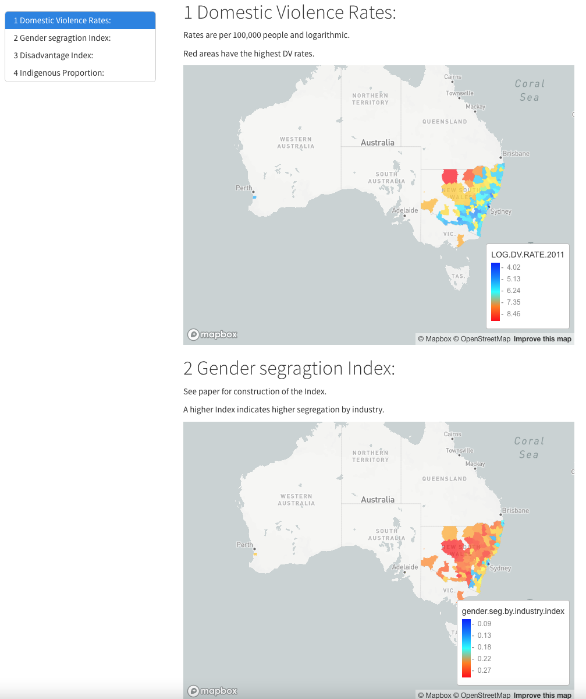

# Gender segregation and DV rates NSW

This repository contains my paper 

> 'Spatial analysis of Gender segregation in the workforce and the relationship to domestic violence rates in NSW LGA's'

that I wrote as part of the course **DATA5207 Data Analysis in the Social Sciences** at the University of Sydney. 

Due to limitations in public GitHub repositories, I was not able to upload all data files and all outputs. 

## Files

### Research_Project.pdf

The final paper can be accessed through Research_Project.pdf. All code and text used to generate this paper with latex engine xelatex are contained in Research_Project.rmd.

### interactive_maps.rmd

interactive_maps.rmd generates interactive maps of different variables, however the original output interactive_maps.html is too large to upload. Mapbox was used to generate these interactive maps. You can run the .Rmd locally to generate the full html.

This screenshot displays a snippet of the html output. 

## Missing data file

The data file which was too large to upload is `LGA_2011_AUST.shp`. Please refer to the paper or the sources of the data (Australian Bureau of Statistics). 
